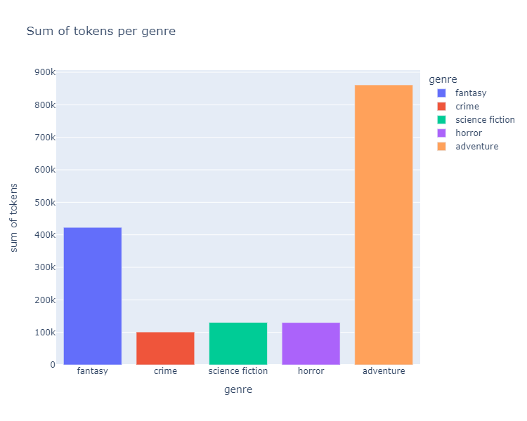
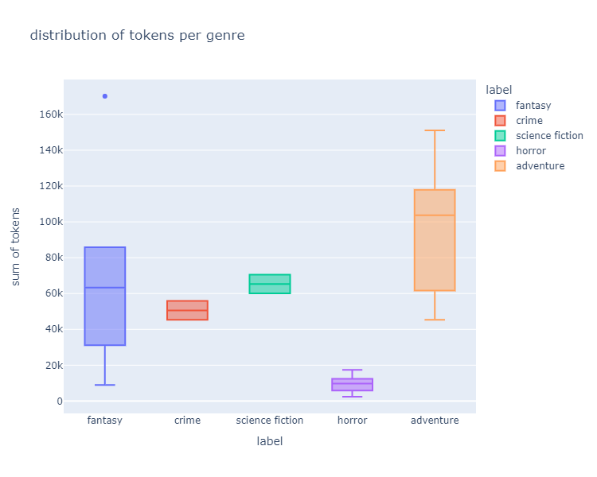

# little-pulp-corpus

This is a small collection of pulp texts in the public domain, which can be used for zero-shot classification experiments. There are 33 works of 14 authors mostly, but not exclusively, from the pulp era, the 1920ies. It contains novels and short stories of different genres: adventure, horror, science fiction, and crime. 

For its initial purpose the corpus was used to perform a number of experiments regarding utilizing a zero-shot classification pipeline as an alternative method of corpus exploration in computational literary studies.

The texts were chosen by availability: firstly, if a text was part of the **Project Gutenberg** collection and secondly, if a text could be easily labeled by genre. The first look for a label was a Wikipedia genre label for the text or, if there was not entry, by looking at the text itself.    

## Pre-processing for zero-shot classification experiments 

The texts provided by **Project Gutenberg** should be cleaned of the header and the license at the star and the end of the text. Regarding the longer novels, it might be advantageous to split them into chapters which can be achieved using simple regular expressions. The short story collection **The King in Yellow** by Robert W. Chambers was split into its short stories and is not separately listed here. 

## Further statistical description

The complete corpus is relatively small, as it is just under 1.65 million tokens long. By far the most tokens are provided by the adventure text, followed by the fantasy genre. The following figure shows the number of tokens for each genre. The following figure shows the distribution of text length in each genre. The single point for the fantasy boxplot is *The Worm Ouroboros* by Eric R. Eddison, which is the longest text of all.

